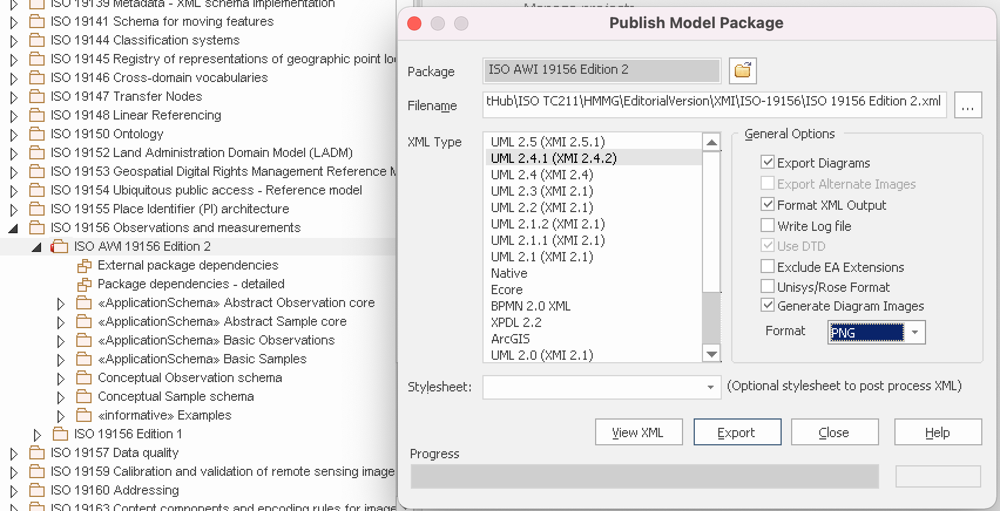

= ISO 19156 in model-based format

== Purpose

This document was developed to provide the ISO 19156 team a listing
of UML models from the ISO/TC 211 Harmonized Model.

== Prerequisites

The `models/` directory contains the following files:

* `ISO 19156 Edition 2.xml`, exported from Enterprise Architect in the XMI
  2.4.2 format. This must be exported without checking the "Exclude EA data"
  box.
* `images/`, exported from Enterprise Architect (PNG and EMF files)

The ISO/TC 211 Harmonized Model is openly available:
https://github.com/ISO-TC211/HMMG/blob/master/EA/ISOTC211_HM.eap

Export options:

== Usage

Install Metanorma.

Run the following command.

[source,sh]
----
metanorma site generate
----

== License

Prioritary to the ISO 19156 team.

